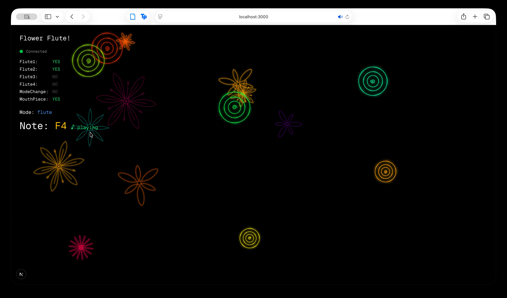

# Flower Flute!

An art project by Teo Maayan, for COMS3930 (Columbia).

What if a flower could be a flute? Turns out it can!

My piece is built around a Cj Hendry plush flower. It is played similarly to a flute: you hold it up to your mouth and 
play notes using two hands. Notes can be varied by touching one of four capacitive surfaces on the flower, 
and you can switch from flute mode into clarinet mode by smelling it (aka by touching a capacitive surface in the 
petals)

You can read more about my creative process 
[in my blog post](https://medium.com/p/8d9ee1a7e770), and more 
images [on my website](https://teo.ma/portfolio/flower-flute)

## Materials
- One Cj Hendry flower
- A LILYGO T1/T-Display ESP32
- A compatible battery (I used an EEMB LP401730)
- A breadboard
- some wires
- copper tape
- (A lot of ) green duct tape

## Reproduction
This guide focuses more on the code than the physical object, but reproducing that should not be difficult either. 
Essentially, you'd have to purchase the materials described above, and attach copper tape via a wire to the correct 
GPIO pins (see code for reference), and assemble the materials in a way that is visually appealing.

This guide is written as specific to the LILYGO T1/T-Display ESP32, but it should be easily adaptable to
other similar devices, though you might have to tweak the code a bit.

### Requirements
- Hardware (see above)
- A working Visual Studio Code and PlatformIO setup
- NPM

### Step 1: ESP32 Installation
Via PlatformIO (or another tool), build and upload the code in `src/` to your device. You might have to tweak the GPIO 
pins used in `src/main.cpp`.

### Step 2: Start web app
Run the web app in webapp/ using `npm run dev`.

### Step 3: Connect
Connect to the `Flower Flute` Wifi network (password `12345678`). Go to `localhost:3000`.

### Step 4: Play!
Start playing your flute! The web app should detect your flute and visualize the notes you play.